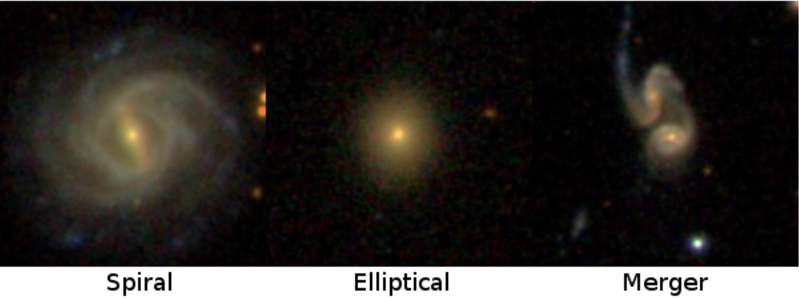

# AstroML Galaxy Analysis

## Overview
This repository contains two interconnected machine learning projects focused on galaxy analysis using data from the Sloan Digital Sky Survey (SDSS):
1. **Redshift Regression**: Predicts galaxy redshifts using photometric data.
2. **Galaxy Morphological Classification**: Classifies galaxies into three morphological types (merger, elliptical, spiral) using various features including predicted redshift.

These projects demonstrate the application of machine learning techniques to astronomical data, aiming to accelerate research in galaxy evolution and cosmology.


*Figure: Examples of different galaxy types used in the classification model.*

## Quick Start with Google Colab

The Jupyter notebooks in this repository can be run directly in Google Colab without any local setup:

1. Click on the notebook you want to run (`redshift_regression.ipynb` or `galaxy_classification.ipynb`) in the GitHub repository.
2. Look for the "Open in Colab" button at the top of the file viewer.
3. Click the button to open the notebook in Google Colab.
4. Run the cells in the notebook sequentially.

## Repository Contents
- `redshift_regression.ipynb`: Jupyter notebook for the redshift prediction model
- `galaxy_classification.ipynb`: Jupyter notebook for the galaxy classification model
- `sdss_galaxy_colors.npy`: NumPy file containing SDSS galaxy color data
- `galaxy_catalogue.npy`: NumPy file containing galaxy catalogue data
- `redshift_model.joblib`: Saved redshift prediction model
- `galaxies.png`: Image file showing examples of galaxy types

## Features
- Data preprocessing and exploratory data analysis of SDSS galaxy data
- Implementation of XGBoost for redshift prediction
- Deep learning model using TensorFlow/Keras for galaxy classification
- Integration of redshift predictions into the classification model
- Comprehensive model evaluation and visualization

## Local Installation (Alternative)
If you prefer to run the notebooks locally:

1. Clone this repository:
   ```
   git clone https://github.com/yourusername/AstroML-Galaxy-Analysis.git
   ```
2. Navigate to the project directory:
   ```
   cd AstroML-Galaxy-Analysis
   ```
3. Install required packages:
   ```
   pip install numpy pandas matplotlib seaborn tensorflow scikit-learn xgboost joblib
   ```

## Usage

1. Open and run the Jupyter notebooks:
   ```
   jupyter notebook redshift_regression.ipynb
   jupyter notebook galaxy_classification.ipynb
   ```

Note: If running locally, ensure you have Jupyter Notebook installed and that the .npy data files are in the same directory as the notebooks.

## Results

### Redshift Regression
XGBoost model:
- Mean Squared Error: 0.058631 
- R-squared score: 0.797278

Ridge Regression:
- Mean Squared Error: 0.157324
- R-squared score 0.443480

### Galaxy Classification
- Test Accuracy: 0.8564
- ROC AUC Score: 0.9369
